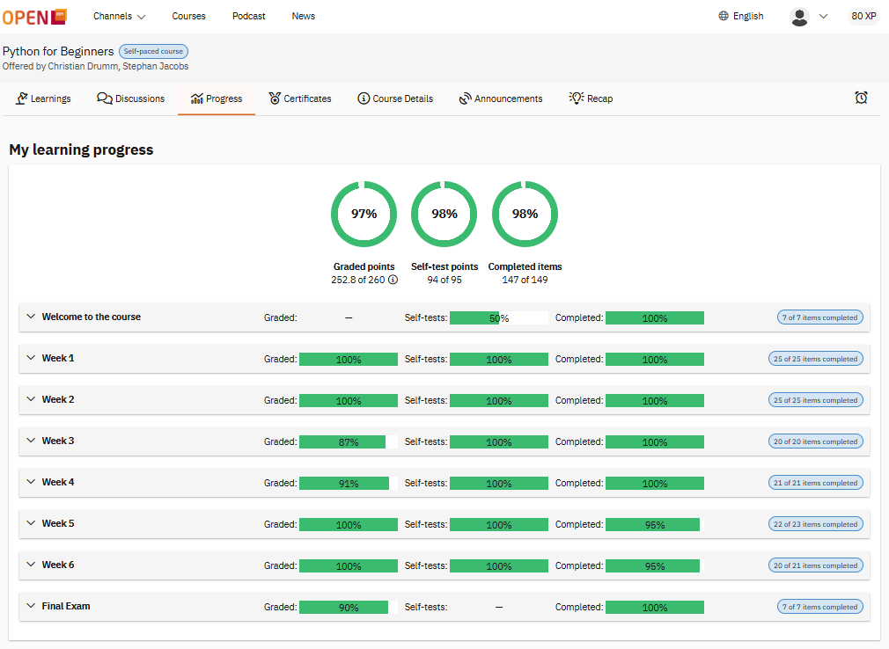
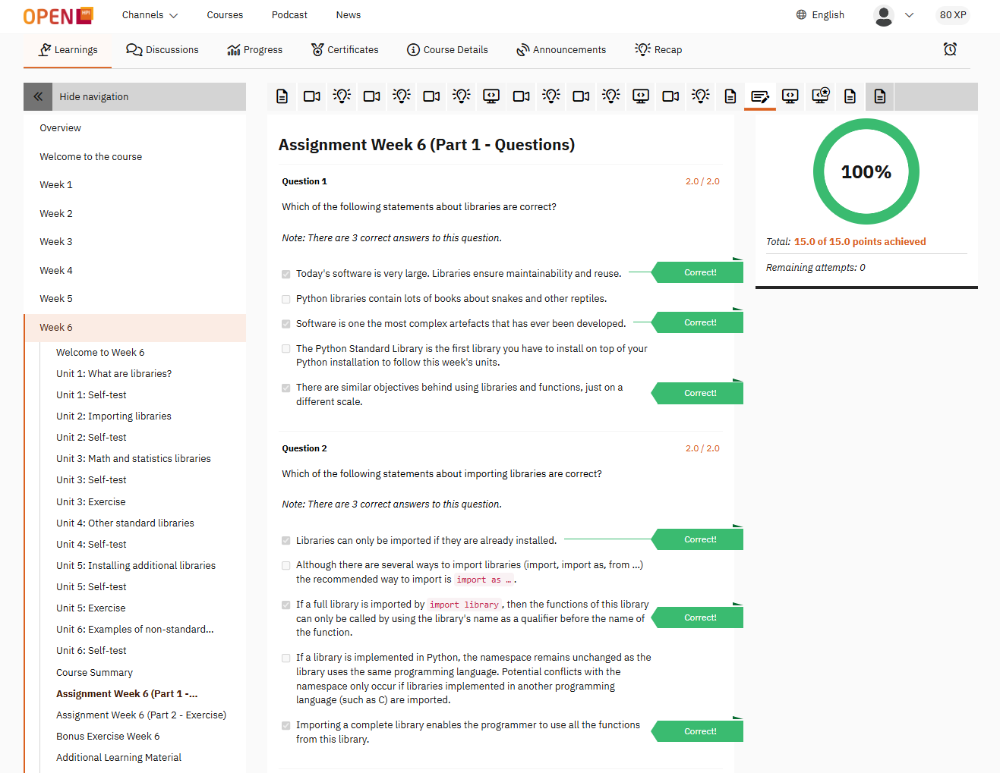
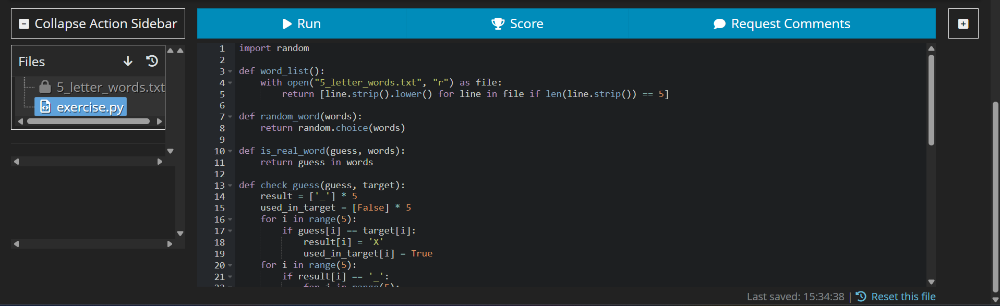
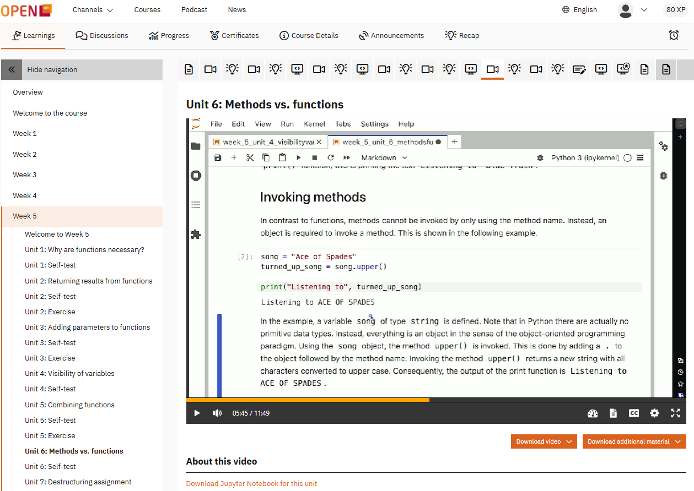
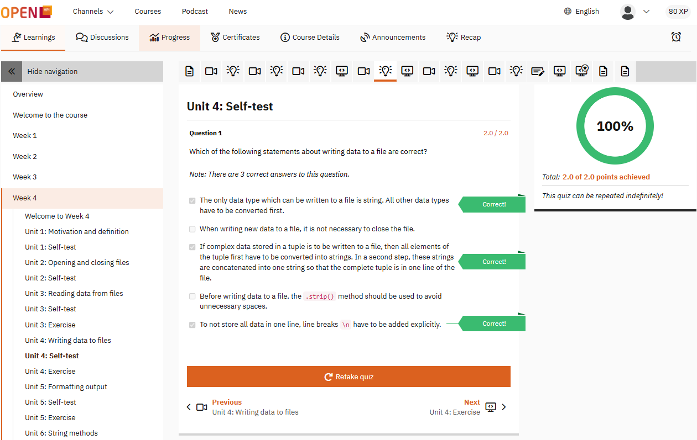

# Python Course — openHPI 2025

A six-week journey into modern Python programming

     

## About This Repository

This repository documents my progress through the
Python for Beginners (2025) course on openHPI.

It contains all my completed coding exercises, weekly assignments, screenshots, and personal notes.
The goal is to demonstrate the learning path, show real course output, and provide an example for others interested in the course.

## About the openHPI Python Course

According to the course overview, the Python for Beginners track teaches the essentials of Python through:

## What You Learn:

How to install and run Python programs

Variables, data types, and basic operators

Writing functions and using return values

Loops (for, while) and conditional logic

Working with lists, strings & collections

File handling

Error handling and debugging

Best practices for clean and readable Python code

## Format

6-week program

Weekly lectures & video explanations

Interactive coding exercises in the browser

Short quizzes after each unit

Final exam + weekly graded tasks

Certificate upon successful completion

The course is suitable for complete beginners, but also useful for refreshing fundamentals.

## Purpose of This Project

I created this repository to:

Track my personal learning progress

Store and version-control my exercises

Demonstrate my understanding of Python

Build a structured and professional portfolio piece

## Screenshots

All screenshots are organized in /screenshots.

### Exams & Results

My learning progress:

Weekly Exam:
There always were about 15 quastions.

### Learning Interface

Coding Environment / Compiler

### Video & Questions

Video Tutorial Player

Short Questions After Videos

## Certificate

I have successfully completed the **Python for Beginners (2025)** course on openHPI.

### 📄 Official Certificates

You can view/download the certificates here:

- [Certificate Part 1 (PDF)](certificates/python2025_RecordOfAchievement.pdf)
- [Certificate Part 2 (PDF)](certificates/python2025_ConfirmationOfParticipation.pdf)

### Certificate Screenshot

